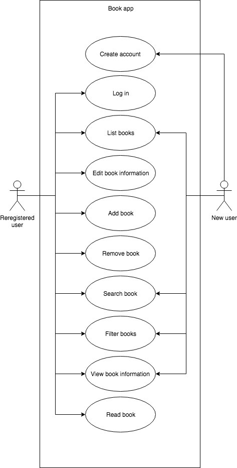

# Use cases
1. Create account
2. Log in
3. List books
4. Edit book information
5. Add book
6. Remove book
7. Search book
8. Filter books
9. View book information
10. Read book
___
### Use case diagram

___
## Use case documentation - Add book
A user wants to add a new book to the system.

__Pre condition:__ The user is logged in and a book exists and needs to be edited.

__Post condition:__ The book has been updated with new information.

### Main scenario
1. The user wants to edit a book.
2. The user finds the book in the system.
3. The system returns the current book information.
4. The user changes the fields containing the informations he or she wants to change.
5. The user clicks the save button.
6. The system updates the book information.
7. The system message the user that the book has been updated.

### Secondary scenario
6.1. The system fails to update the book information. 
7.1. The system message the user that something went wrong in case of an error.
___

## Activity Diagram for edit a book

___
## Use case documentation - Edit book information
A user wants to update the current book information with new information.

__Pre condition:__ The user is logged in and a book exists and needs to be edited. 
__Post condition:__ The book has been updated with new information.

### Main scenario
1. The user wants to edit a book.
2. The user finds the book in the system.
3. The system returns the current book information.
4. The user changes the fields containing the informations he or she wants to change.
5. The user clicks the save button.
6. The system updates the book information.
7. The system message the user that the book has been updated.

### Secondary scenario
2.1. The book doesn't exsists and the user has to add the book instead. 
6.1. The system fails to update the book information. 
7.1. The system message the user that something went wrong in case of an error.
___

## Activity Diagram for edit a book

