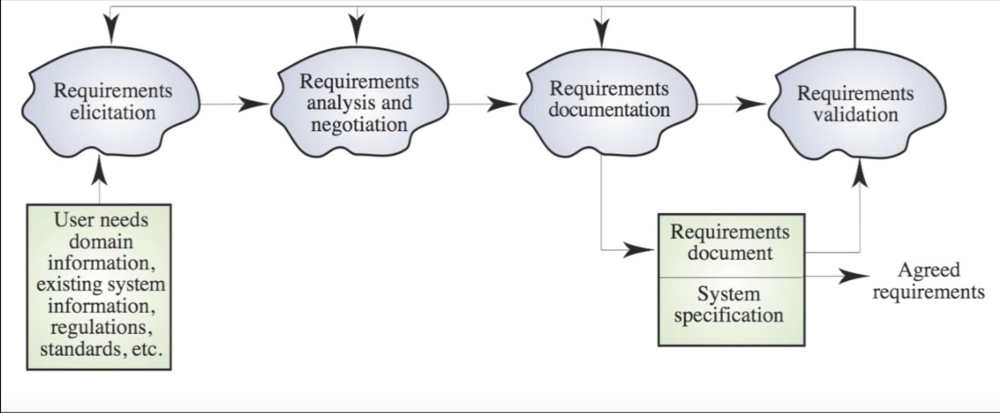
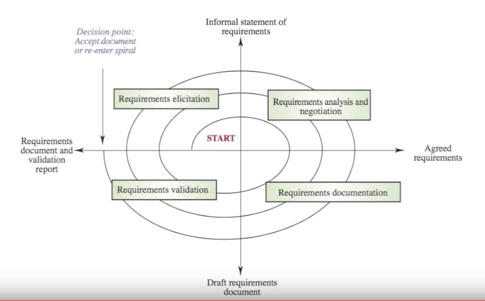
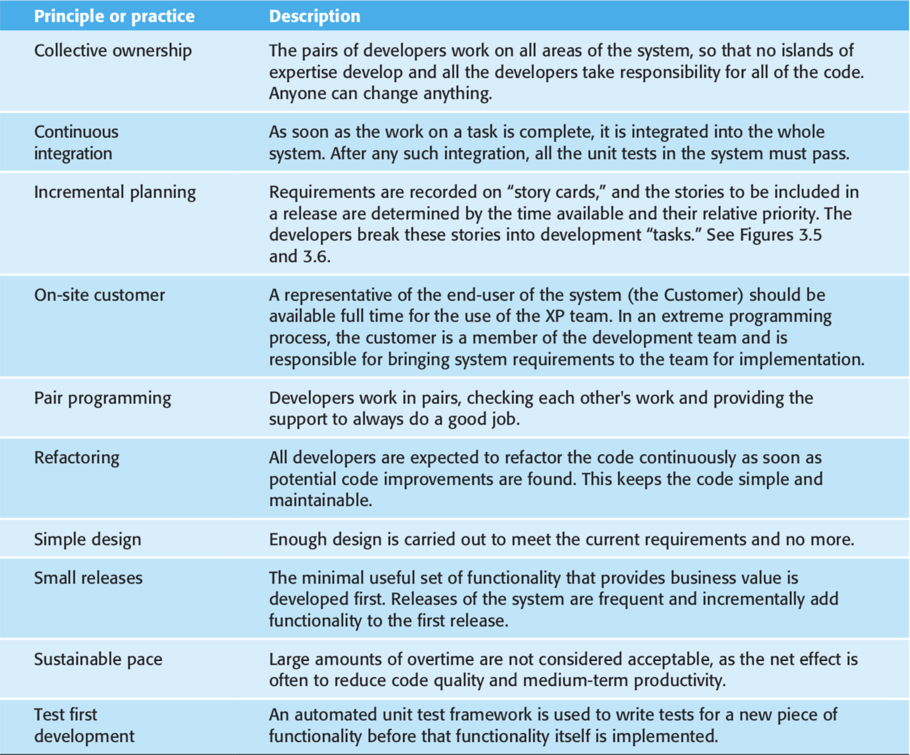
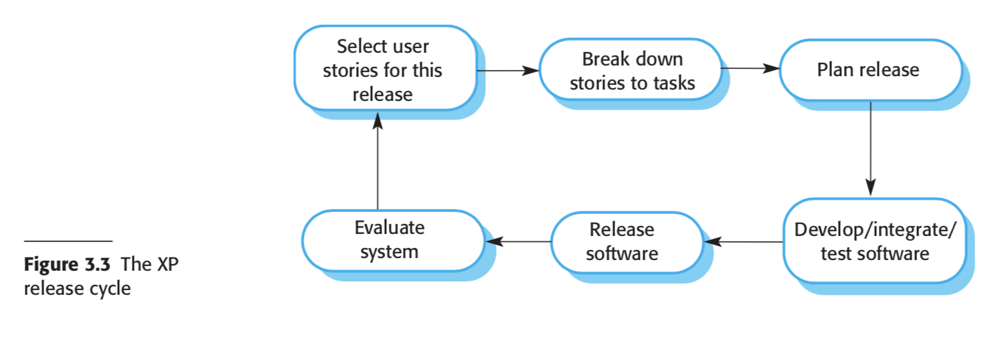

# Knowledge for theme 1
The following are a number of questions that you should be able to answer from this theme.

1. ## What is a software development process?
    A set of related activities that leads to the production of a software system.

    En uppstruktured process för att utveckla en mjukvara.

1. ## What different software process models are common?
    1. Incremental development
        * Kanban
        * Scrum
        * XP
    2. [Unified process](https://softwareengineering.stackexchange.com/questions/120351/what-are-the-differences-between-the-unified-process-and-the-rational-unified-pr)
        * Rational Unified Process
        * Open UP
    4. Waterfall (is a plan driven process)
    5. Integration and configuration
    6. Boehm’s spiral process model (Risk driven)

1. ## What are the general activites in the waterfall model?
    In theory each phase needs to be approved and signed off before starting on the next. But in reality, the line is not as sharp since the next phase often will show mistakes made in the phase before.

    1. __Requirements analysis and definition__ The system’s services, constraints, and goals are established by consultation with system users. They are then defined in detail and serve as a system specification.

    2. __System and software design__ The systems design process allocates the requirements to either hardware or software systems. It establishes an overall system architecture. Software design involves identifying and describing the fundamental software system abstractions and their relationships.

    3. __Implementation and unit testing__ During this stage, the software design is realized as a set of programs or program units. Unit testing involves verifying that each unit meets its specification.

    4. __Integration and system testing__ The individual program units or programs are integrated and tested as a complete system to ensure that the software requirements have been met. After testing, the software system is delivered to the customer.

    5. __Operation and maintenance__ Normally, this is the longest life-cycle phase. The system is installed and put into practical use. Maintenance involves correcting errors that were not discovered in earlier stages of the life cycle, improving the implementation of system units, and enhancing the system’s services as new requirements are discovered.

1. ## What is done during the different activities?
    See the answer above.

1. ## What is the difference between analysis and design?
    Analysis is about figuring out what and design is how.

1. ## What are the pros and cons of incremental development?
    [Agile for noobs](https://www.cio.com/article/3156998/agile-development/agile-project-management-a-beginners-guide.html)
    #### Pros
    1. Kostnaden på snabba ändringar blir mindre.
    2. Mindre tid på planering, design och dokumentering.
    3. Enklare att få feedback.
    4. Programmet blir snabbare användbart och kan fortare releasa en version.

    #### Cons
    1. Processen blir inte lika tydlig eftersom det blir färre dokument.
    2. Risken att få dålig struktur/kod är större eftersom det suggessivt läggs till mer funktionalitet.
    3. Du har ingen övergripande design att validera emot som kan vara dåligt i applikationer där sådana kriterier är viktiga (typ bromssystemet på en bil)

1. ## What is the requirements engineering process?
    1. __Requirement elicitaion__ trying to discover what the requirements are.

    2. __Requirements analysis and negotiation__ Analyse the things found in the step before. Looking for inconsistensies and things that we need to find out more about. It will go back and fourth between step 1 and 2 to develop and refine the requirements.

    3. __Requirements documentation__ the requirements needs to be documented and written down in such a way that they are understandable to both the system stakeholders and engineers. These are often informal because to formal requirements can be hard for stakeholders to understand.

    4. __Requirements validation__ were we take these requirements back to the stakeholders to varify that is is what they want.

    This is a iterative process. It's always time restraints. Working in a spiral until we run out of time and hope that it is enough for the system implementation. Problems with requirements often arise because this process wasn't allowed to take enough time.

    
    

1. ### How requirements engineering can be fitted into the software engineering process
    Requirements engineering is usually presented as the first stage of the software
    engineering process. However, some understanding of the system requirements may have to be developed before a decision is made to go ahead with the procurement or development of a system.

    

1. ## What is software validation?
    The aim of software validation is to ensure that the software meets the customer’s expectations.

1. ## What is the idea behind agile methods?
    1. Spendera mer tid på utveckling snarare än att dokumentera och planera.
    1. Att möta förändringar i utvecklingen på ett mer effektivt och mindre kostsamt sätt.
    2. (Låta koden dokumentera systemet istället för använda sig av andra dokument för det.) <- snarare en konsekvens.

    _"We are uncovering better ways of developing software by doing it and helping others do it. Through this work we have come to value:_

    _Individuals and interactions over processes and tools_

    _Working software over comprehensive documentation_

    _Customer collaboration over contract negotiation_

    _Responding to change over following a plan_

    _That is, while there is value in the items on the right, we value the items on the left more"_

    ### Principle of agile methods
    

1. ## Agile methods have been particularly successful for two kinds of system development.
    1. Product development where a software company is developing a small or medium-sized product for sale. Virtually all software products and apps are now developed using an agile approach.

    2. Custom system development within an organization, where there is a clear commitment from the customer to become involved in the development process and where there are few external stakeholders and regulations that affect the software.

    Agile methods work well in these situations because it is possible to have continuous communications between the product manager or system customer and the development team. The software itself is a stand-alone system rather than tightly integrated with other systems being developed at the same time. Consequently, there is no need to coordinate parallel development streams.

1. ## What techniques are used during agile development?
    

1. ## How does XP work?
    Extreme Programming is based on the agile manifesto and is implementing agile techniques.

    ### Agile manifesto
    1. Incremental development is supported through small, frequent releases of the sys- tem. Requirements are based on simple customer stories or scenarios that are used as a basis for deciding what functionality should be included in a system increment.

    2. Customer involvement is supported through the continuous engagement of the customer in the development team. The customer representative takes part in the development and is responsible for defining acceptance tests for the system.

    3. People, not process, are supported through pair programming, collective owner- ship of the system code, and a sustainable development process that does not involve excessively long working hours.

    4. Change is embraced through regular system releases to customers, test-first development, refactoring to avoid code degeneration, and continuous integration of new functionality.

    5. Maintaining simplicity is supported by constant refactoring that improves code quality and by using simple designs that do not unnecessarily anticipate future changes to the system.

    ### Extreme programming practices
    
    

1. ## What are user stories?
    A user story is a scenario of when a user is using the system and it describes what happens. This an informal description of a feature and a way to identify useful functionality. The story will later be decomposed to task to implement the feature.

    E.g. "As a user, I can back up my harddrive. If the file is corrupt I will be informed."

1. ## What is the idea with test driven developement?
    __TDD = Refactoring + TFD.__
    It’s about design rather than testing. Write test early. Comes from Test First development.
    The idea is to decompose implemention problems into smaller easy to test parts.

1. ## Why can pair programming make software better? Or worse?
    Collective ownership - alla känner sig delaktiga.
    Det blir en kontinuerlig kodreview.
    Behöver inte lika mycket dokumenation.
    Kvaliten ökar eftersom man diskuterar implementationen innan och undertiden.
    Olika personer kan ge olika inputs beroende på erfarenhet.

    En nackdel är att det är bara en som kodar vilket minskar effektiviteten.
    Det blir då en högre kostnad för att få ut koden.

1. ## How is Scrum designed?
    A mix between XP and managed focused methods.

1. ## What is a product backlog and how is it different from a sprint backlog?
    __Product backlog__ is a to do for the whole project.
    __Sprint backlog__ is just for one interation. Based on the product backlog.

1. ## How can agile methods scale?
    1. Scaling up these methods to handle the development of large systems that are too big to be developed by a single small team.

    2. Scaling out these methods from specialized development teams to more widespread use in a large company that has many years of software development experience.

1. ## What are the problems with agile approaches?
    Blir inte så mycket dokumentation.
    Svårare att bevisa framsteg i projeket.
    Managment har inte lika mycket att säga till om.
    Det kan vara svårt att få en tydlig bild av systemet om personer slutar pga brist av dokumentation.

    1. The informality of agile development is incompatible with the legal approach to contract definition that is commonly used in large companies.

    2. Agile methods are most appropriate for new software development rather than for software maintenance. Yet the majority of software costs in large companies come from maintaining their existing software systems.

    3. Agile methods are designed for small co-located teams, yet much software development now involves worldwide distributed teams.

1. ## How can agile methods be used with development of large systems?

1. ## What are the goals of successful project management (in general terms)?
    1. Deliver software in time (keep deadline)
    2. Keep overall costs within budget.
    3. Deliver a software that meets the customer's expextation
    4. Maintain a well functioning development team.

1. ## How are software projects different from other projects?
    Du skapar inte en fysisk produkt och kan därför bli svårare att få en bild av produkten.

    Software projects är väldigt enskilda och det blir olika projekt varje gång.

    Olika företag har olika processer och det blir svårare att identifera fel och veta om projektet kommer att lyckas.

1. ## Name and explain the fundamental activities for project management.
    1. Project planning
    2. Risk management
    3. People management
    4. Reporting - Report progress to customers'
    5. Proposal writing - Skapa offerter för att få projekt av kunder.

1. ## What is a risk?
    Något som påverkar projektet, systemet eller orginisationen negativt.

1. ## Explain project risk, product risk and business risk.
    1. Project risk - Något som påverkar projektets schema eller resurser. T.ex. erfaren lämnar projektet.
    2. Product risk - Påverkar kvalitén eller prestandan av systemet. Köper en komponent som inte presterar som man har tänkt sig.
    3. Business risk - Påverkar organisationen som utvecklar systemet. T.ex. ett annat företag släpper en motsvarande produkt innan eller som är bättre.

    Alla tre riskerna påverkar varandra. T.ex. om någon erfaren lämnar så kan det påverkar kvalitén av produkten som i sin tur påverkar business.

1. ## What is risk management?
    Ett sätt att minimera risken för att en risk inträffar och effekten av detta.

1. ## Name some of the types of risk that can be identified.
    1. Estimation risk - Estimera resurser och tid fel.
    2. Organisation risk - Dålig arbetsmiljö. __dubbel kolla detta__
    3. People risk - T.ex. folk blir sjuka.
    4. Requirements risk - Kraven förändras och hur man ska hantera detta.
    5. Technoligy risk - Software or hardware som inte fungerar som det var tänkt.
    6. Tools risk - Om det blir några fel på verktygen som används under utvecklingen.

1. ## Risk management
    1. __Risk identification__ - You should identify possible project, product, and business risks.

    2. __Risk analysis__ - You should assess the likelihood and consequences of these risks.

    3. __Risk planning__ - You should make plans to address the risk, either by avoiding it or by minimizing its effects on the project.

    4. __Risk monitoring__ - You should regularly assess the risk and your plans for risk mitigation and revise these plans when you learn more about the risk.

1. ## What is risk analysis?
    Analyserar sannorlikheten och effekten av eventuella risker.

1. ## What is risk planning?
    Hur man ska undvika eller minimera effekten av riskerna.

1. ## What strategies can be used to manage risk?
    1. Avoidance strategy - Försöka undvika en risk.
    2. Mimization strategy - Minimera effekten ifall risken sker.
    3. Contingency plan - En back up plan om man inte kan fånga upp en risk i de andra två stegen. 

1. ## How is risk monitored? *
    Försöka se om en risk är påväg att förverkligas eller om risken har förändrats. Se om nya risker har uppståt eller om någon har minskat.

1. ## Managing people introduces a number of problems, explain some of them.

1. ## How can people be motivated?
1. ## What influences effective and efficient group communication?
1. ## How is software priced?
1. ## What is plan-driven development?
1. ## How is plan-driven development different from agile planning?
1. ## What is plan-driven developement consisting of?
1. ## What is in a project plan?
1. ## In what ways can a plan of activities be presented?
1. ## What is agile planning?
1. ## In what two general ways can project schedules be estimated?
Explain one.
Abilities
These are the abilities you should have after studying the theme:

Decide on a suitable software process depending on the project.
Plan a plan-driven project.
Plan an agile project.
Identify and plan for risk in a project.
Know how to select a suitable team for a project.
Have a knowledge of how to make time estimates for a project's activities.
Know how to scale a project if needed.
Have ideas for how to successfully lead and motivate the team.

# Glossary
| word | definition |
| --- | --- |
| process paradigms | Process model |